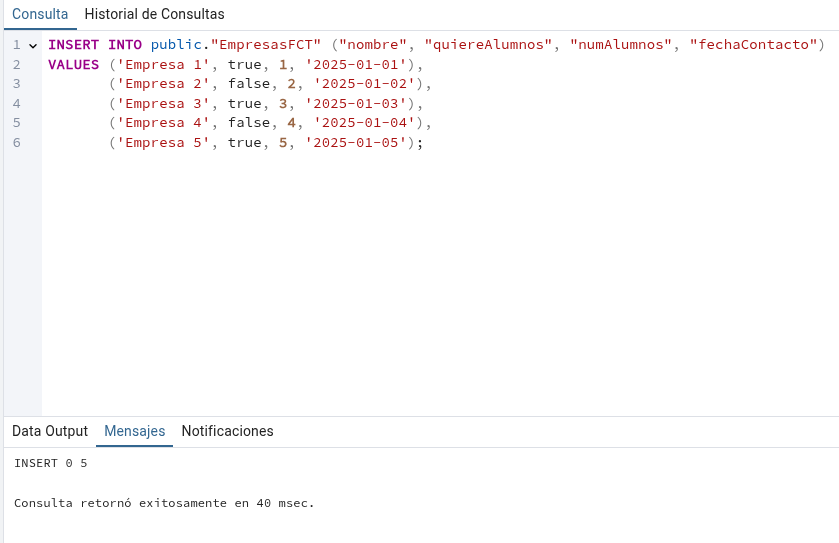
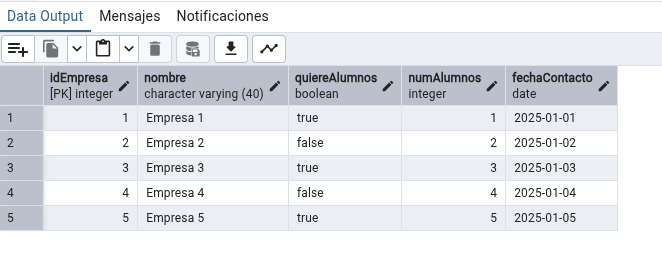

# Tarea12SXE - Pedro Piñeiro Ordax

## Apartado 1

Entramos en el pgAdmin y nos conectamos a la base de datos de odoo, una vez dentro vamos a crear las tablas de forma manual, vamos a Tablas y creamos una, insertando los datos solicitados

## Apartado 2

Para insertar 5 registros ponemos esta query

Para comprobarlo le damos a ver todas las tablas en EmpresasFCT

