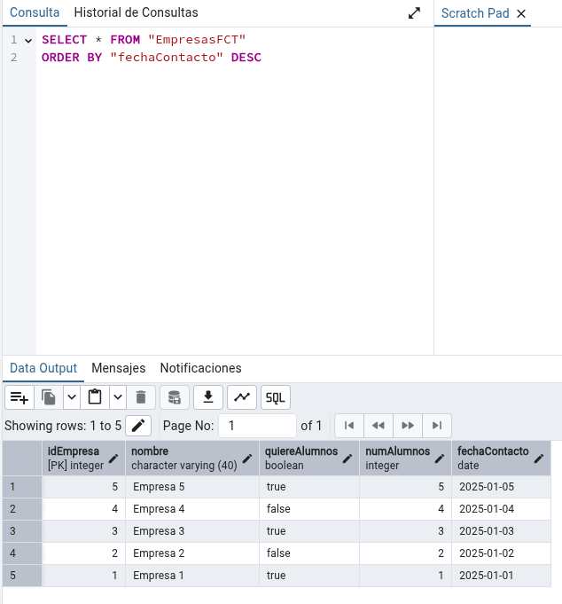
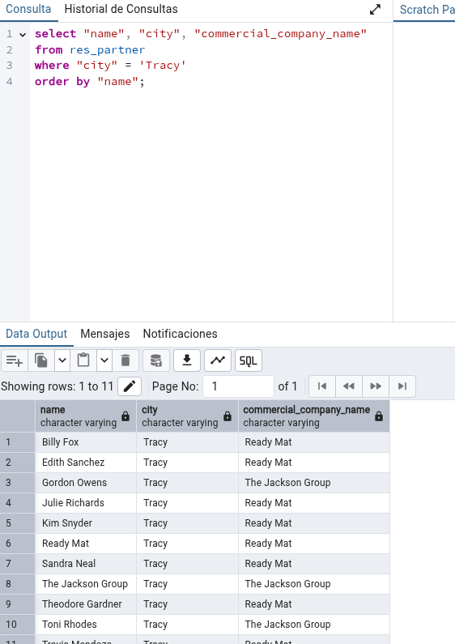
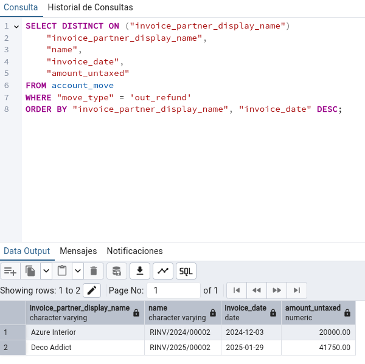
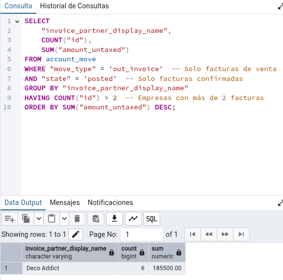
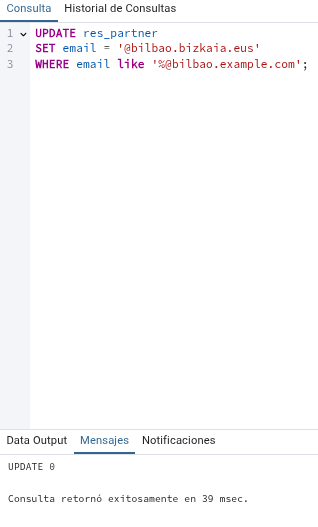
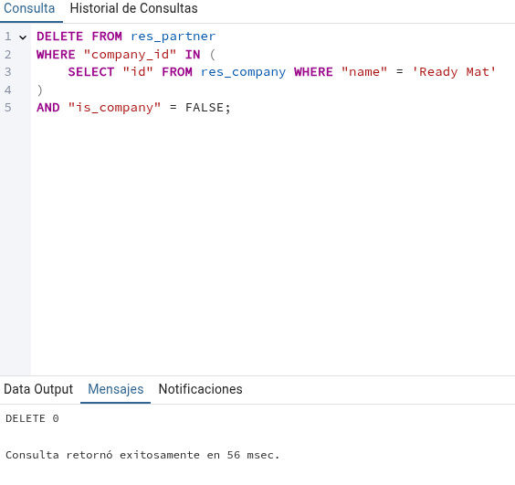

# Tarea12SXE - Pedro Piñeiro Ordax

## Apartado 1

Entramos en el pgAdmin y nos conectamos a la base de datos de odoo, una vez dentro vamos a crear las tablas de forma manual, vamos a Tablas y creamos una, insertando los datos solicitados


## Apartado 2

Para insertar 5 registros ponemos esta query


Para comprobarlo le damos a ver todas las tablas en EmpresasFCT


## Apartado 3

En el apartado de query escribimos esto
```sql
select * from "EmpresasFCT" order by "fechaContacto" desc;
```


## Apartado 4

```sql
select "name", "city", "commercial_company_name" 
from public.res_partner 
where "city" = 'Tracy'
order by "name";
```


## Apartado 5

```sql
SELECT DISTINCT ON ("invoice_partner_display_name") 
    "invoice_partner_display_name", 
    "name", 
    "invoice_date", 
    "amount_untaxed"
FROM public.account_move
WHERE "move_type" = 'out_refund'
ORDER BY "invoice_partner_display_name", "invoice_date" DESC;
```


## Apartado 6

```sql
SELECT 
    "invoice_partner_display_name", 
    COUNT("id"), 
    SUM("amount_untaxed")
FROM account_move
WHERE "move_type" = 'out_invoice'  -- Solo facturas de venta
AND "state" = 'posted'  -- Solo facturas confirmadas
GROUP BY "invoice_partner_display_name"
HAVING COUNT("id") > 2  -- Empresas con más de 2 facturas
ORDER BY SUM("amount_untaxed") DESC;
```


## Apartado 7

```sql
UPDATE res_partner
SET "email" = replace("email", '@bilbao.example.com', '@bilbao.bizkaia.eus')
WHERE "email" LIKE '%@bilbao.example.com';
```


## Apartado 8

```sql
DELETE FROM res_partner
WHERE "company_id" IN (
    SELECT "id" FROM res_company WHERE "name" = 'Ready Mat'
)
AND "is_company" = FALSE; 
```
